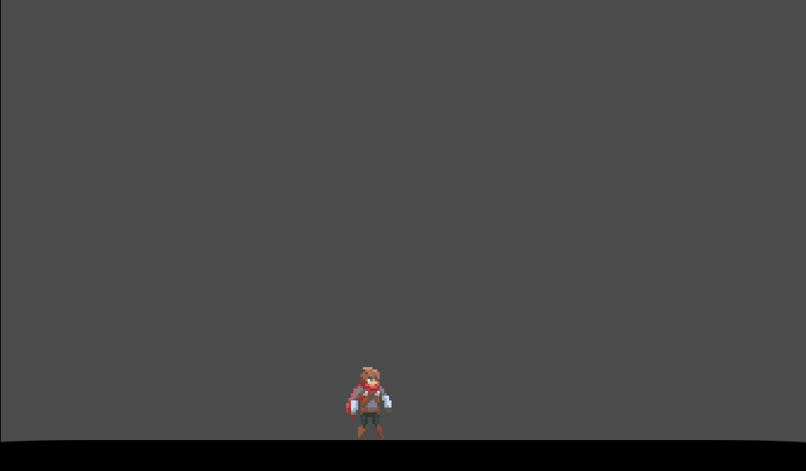

# State Machine

At any point in our game, the game objects will be in a particular State such as 
Waiting, Jumping, and Running. In order to change State, some event occurs such as a Key Press
Created to learn game development.

## Tecnologias

Esse projeto foi desenvolvido com as seguintes tecnologias:

- [Godot Engine](https://godotengine.org/)

## Screenshot

  

## Features

- [] Avoid obstacles (collision)
- [x] Walking left and right
- [x] Double jump
- [x] Triple jump
- [x] Animation on walk/idle
- [x] Attack with animation
- [] Player & monster stats
- [] Monsters tries to reach the player
- [] Monsters attacks
- [] Player dies
- [] UI bars
- [] Monsters wander around when player's near
- [] A-Star algorithm when monsters trying to reach the player
- [] A cool map
- [x] Animation on attack
- [] Stats bars on monsters
- [] Ranged monsters and weapons

